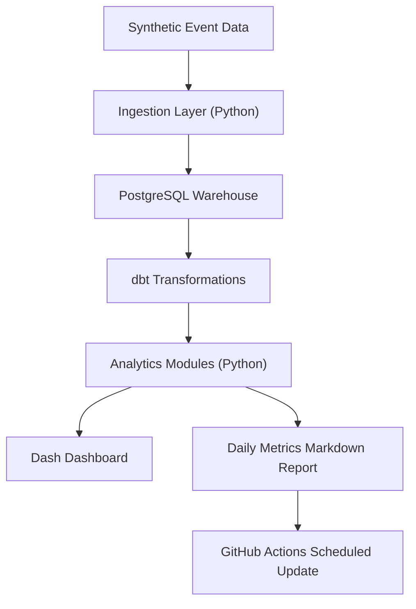

# SaaS Product Analytics Engine

Status: **In Progress (MVP built, extensible for production hardening)**

An end-to-end analytics pipeline that simulates SaaS user behavior, computes activation funnel conversion, weekly cohort retention, feature engagement, and A/B test outcomes, then publishes interactive dashboards and an automated daily metrics report.

## Architecture



## Key Analytical Outputs

- Activation funnel with step-level conversion and largest drop-off detection.
- Weekly cohort retention matrix and heatmap.
- A/B test significance report with p-value, confidence interval, and MDE.
- Daily executive markdown report for product and growth teams.

Generated artifacts:

- `reports/funnel.png`
- `reports/cohort_heatmap.png`
- `reports/daily_metrics.md`

## Project Structure

```text
saas-analytics-engine/
├── data/raw/
├── simulate/generate_events.py
├── dbt_project/
│   ├── models/staging/
│   ├── models/intermediate/
│   └── models/marts/
├── analytics/
│   ├── funnel_analysis.py
│   ├── cohort_analysis.py
│   ├── ab_test_evaluator.py
│   ├── churn_risk.py
│   └── generate_daily_report.py
├── dashboards/app.py
├── reports/daily_metrics.md
├── scripts/
│   ├── init_db.py
│   ├── load_to_postgres.py
│   └── run_daily_pipeline.py
├── .github/workflows/daily_pipeline.yml
├── docker-compose.yml
├── requirements.txt
└── README.md
```

## Data Model Overview

Raw tables:

- `raw_events(user_id, event_name, event_ts, session_id, properties, experiment_id, variant, revenue)`
- `dim_users(user_id, signup_ts, plan, channel, country)`
- `ab_test_assignments(experiment_id, user_id, variant, assigned_ts)`

Mart models:

- `fct_funnel`: user-stage conversion states for a 5-step activation funnel.
- `fct_cohort_retention`: cohort week by period-number retention counts.
- `fct_ab_tests`: experiment assignment + conversion + revenue outcomes.
- `fct_feature_engagement`: weekly feature-event usage by user.

## Analysis Modules

- `FunnelAnalyzer(df).compute()` returns step-by-step conversion metrics.
- `CohortRetention(events, users, period='weekly').heatmap()` returns cohort matrix.
- `ABTestEvaluator(control, treatment).evaluate()` returns p-value, CI, MDE, and recommendation.

## How to Run Locally (3 commands)

```bash
python3.12 -m venv .venv && source .venv/bin/activate
pip install -r requirements.txt
python scripts/run_daily_pipeline.py
```

Then run dashboard:

```bash
python dashboards/app.py
```

Open:

- `http://localhost:8050/funnel`
- `http://localhost:8050/cohorts`
- `http://localhost:8050/ab-test`
- `http://localhost:8050/daily-metrics`

## Docker Workflow

```bash
docker-compose up --build
```

For full Postgres path:

1. `python scripts/init_db.py`
2. `python simulate/generate_events.py --users 8000`
3. `python scripts/load_to_postgres.py`
4. `cd dbt_project && dbt run --profiles-dir . && dbt test --profiles-dir .`

## Example Insights Surfaced

- Largest observed funnel drop-off is typically between `onboarding_started` and `onboarding_completed`.
- Treatment variant in the onboarding experiment usually shows directional uplift with explicit confidence intervals.
- Early weekly cohorts reveal sharp week-1 retention decay for free-plan users versus paid plans.

## Tech Stack

- Python: pandas, numpy, scipy, scikit-learn, statsmodels
- SQL + warehouse: PostgreSQL
- Transformations: dbt
- Dashboard: Plotly Dash
- Automation: GitHub Actions
- Deployment: Docker Compose

## Roadmap

- Add segment-level funnels by channel, plan, and geography.
- Add novelty-effect guardrails and Bonferroni corrections for multi-test experiments.
- Add LTV modeling and causal uplift modeling.
- Add data quality alerting thresholds and Slack notifications.
